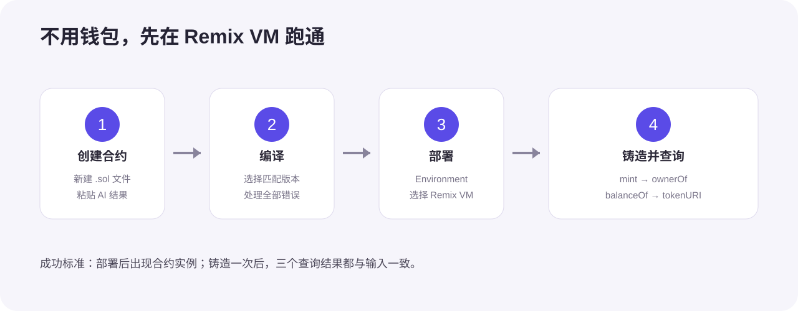
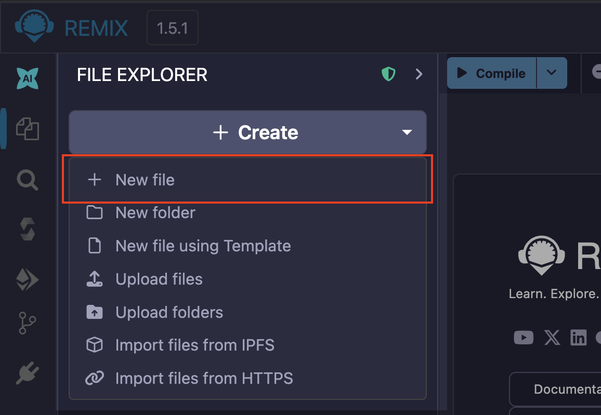
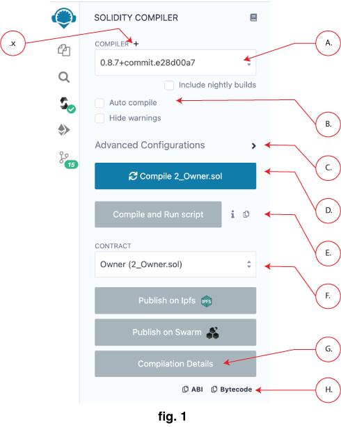
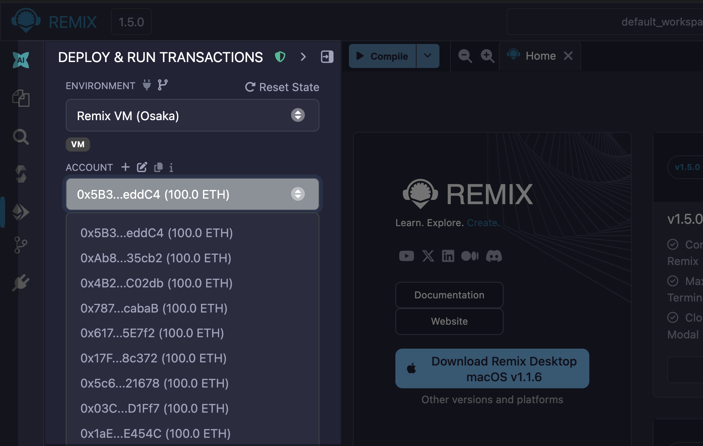
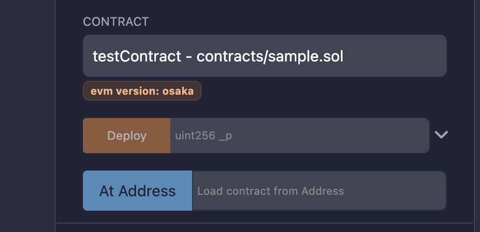
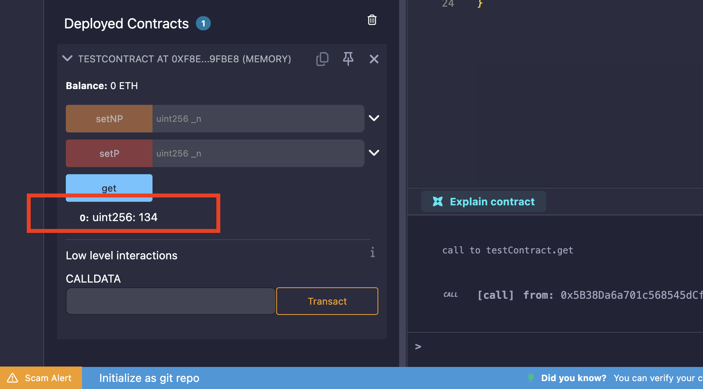

# 用 Remix 完成一次 NFT 铸造

这一篇不先装钱包，也不先领测试币。我们直接在浏览器里的 **Remix VM** 完成一次 ERC-721 合约的创建、编译、部署、铸造和查询。

Remix VM 是浏览器里的模拟区块链，不花钱，也不会碰到真实资产。先把合约闭环跑通，再决定要不要进入公共测试网。

企业把 NFT 做成的软件，通常不只是一张图片。它也可以是活动门票、培训证书、会员凭证、游戏道具、数字收藏或商品溯源记录。真正的产品还会有用户端、运营后台、内容存储和合约监控，这篇先把最核心的合约部分做明白。

## 1. 先理解这次做的东西

NFT 不是“把图片放到区块链上”。常见做法是：合约保存 Token 编号和归属，`tokenURI` 指向 metadata，应用再根据 metadata 显示名称、图片和属性。

这次做一个 **Vibe Certificate**：

- 标准使用 ERC-721；
- 只有部署者可以铸造；
- 每次铸造得到新的 Token ID；
- 可以查询拥有者、余额和 metadata 地址。

我们不做售卖、支付、盲盒、批量铸造或主网发行。功能越少，越容易看清合约有没有写对。

## 2. 打开 Remix

访问 [Remix IDE](https://remix.ethereum.org/)。它会在浏览器里保存工作区，不需要注册账号。

页面第一次打开时可能会询问 AI 与统计偏好。根据自己的需要选择即可，这不会影响后面的编译和部署。

整个操作只有四步：

注意：Remix 的界面会更新，按钮位置可能和截图略有不同。认准左侧的文件、Solidity Compiler 和 Deploy & Run 图标即可。

## 3. 新建合约文件

打开左侧文件面板，在 `contracts` 目录旁点击新建文件，命名为 `VibeCertificate.sol`。

上图来自 [Remix 官方创建与部署教程](https://remix-ide.readthedocs.io/en/latest/create_deploy.html)。

现在让 AI 写第一版，提示词不用复杂：

> 请为 Remix 写一个最小的 ERC-721 合约，名字叫 Vibe Certificate。使用 OpenZeppelin 5.x，只允许部署者铸造，并支持 tokenURI。不要加入收费、批量铸造或升级功能。

把 AI 返回的合约粘贴进 `VibeCertificate.sol`。

先自己看三件事：

- Solidity 版本与当前编译器兼容；
- 使用的是 OpenZeppelin ERC-721；
- `mint` 有权限限制，不是任何地址都能调用。

如果 AI 生成了一大堆暂时用不到的功能，直接说：

> 请删掉白名单、暂停、收费和批量铸造，只保留管理员铸造与 tokenURI。

## 4. 编译合约

点击左侧 **Solidity Compiler** 图标。编译器版本要满足合约顶部的 `pragma` 要求，然后点击 **Compile VibeCertificate.sol**。

编译成功后，文件图标旁通常会出现绿色标记，面板里不会再有红色错误。

如果 OpenZeppelin 导入失败，不要一次改很多地方：

> Remix 编译失败，错误是【粘贴错误】。请只修复 OpenZeppelin 导入或版本问题，保留现有功能。

如果提示 `Ownable` 构造参数缺失，说明当前使用的是 OpenZeppelin 5.x，需要把初始管理员明确传给它。把完整错误交给 AI，不要随便降级依赖版本。

编译通过后，再检查一次：

> 请检查这个合约：非管理员不能铸造，Token ID 不重复，ownerOf 和 tokenURI 可以查询。只修安全问题，不加新功能。

## 5. 部署到免费的 Remix VM

点击左侧 **Deploy & Run Transactions** 图标。在 **Environment** 中选择最上面的 Remix VM 环境。

Remix VM 会提供一组带测试余额的临时账户。这些余额只存在于浏览器模拟环境，没有真实价值，不需要钱包批准。

确认 Contract 选中 `VibeCertificate`，Value 保持为 `0`，然后点击 **Deploy**。

部署成功时，页面下方会出现 **Deployed Contracts**，终端会显示成功交易。

如果 Deploy 按钮是灰色，通常是没有编译当前文件，或者 Contract 选错了。可以问：

> Remix 的 Deploy 按钮不可用。请根据截图只告诉我需要检查哪三个地方。

## 6. 铸造第一枚 NFT

展开刚部署的合约实例。先复制 Remix VM 当前账户地址，作为接收地址。

在 `mint` 的输入框中填写：

- `to`：当前测试账户地址；
- `uri`：先使用一个容易识别的测试地址，例如 `ipfs://vibe-certificate/0.json`。

点击 `mint`。这是写入操作，按钮通常是橙色。Remix VM 会立即执行，不会弹出钱包确认。

终端显示成功以后，不要只看“绿勾”。继续验证链上状态。

## 7. 查询铸造结果

展开合约里的查询函数，依次检查：

1. `ownerOf(0)` 应返回刚才的接收地址。
2. `balanceOf(接收地址)` 应返回 `1`。
3. `tokenURI(0)` 应返回刚才填写的 URI。

蓝色按钮通常表示只读查询，不会产生新的写入交易。

截图里的示例函数名与本篇合约不同，但操作位置相同：展开 Deployed Contracts，填写参数，点击蓝色查询按钮，结果会显示在按钮下方。

三个结果都正确，才算完成第一次铸造。如果 `ownerOf(0)` 报不存在，先看 `mint` 那笔交易是否成功：

> mint 执行后 ownerOf(0) 报错，终端信息是【粘贴内容】。请只判断铸造是否成功，并告诉我下一步检查什么。

## 8. 验证权限真的有效

“代码里写了 onlyOwner”还不够，需要真的试一次。

在 Deploy & Run 面板切换到第二个 Remix VM 账户，再调用 `mint`。正确结果应该是交易失败，合约不产生新的 Token。

然后切回部署合约的第一个账户，再铸造一次。新的 Token ID 应该是 `1`，原来的 Token `0` 仍然属于第一个接收地址。

最后让 AI 帮你核对结果：

> 第二个账户铸造失败，第一个账户可以铸造，Token ID 依次是 0 和 1。请确认这是否通过了管理员权限和编号不重复测试。

## 9. Metadata 怎么准备

刚才填写的 URI 只是测试字符串。实际应用里的 metadata 通常是一份 JSON，至少包含名称、说明和图片地址。

这份 JSON 和图片可以放在企业自己的对象存储，也可以放在 IPFS。无论放在哪里，都要考虑：

- 地址是否能长期访问；
- 内容能否被替换；
- 图片和 JSON 的类型是否正确；
- 用户隐私是否被写进公开内容。

不要把身份证号、手机号、内部工单或其他敏感信息写进公开链上 metadata。

可以让 AI 先生成一份测试内容：

> 请为 Vibe Certificate 写一份最小 metadata，只要名称、说明和图片地址，并解释每个字段。

这篇不要求上传真实文件。先确认 `tokenURI` 能正确返回地址，已经足够完成合约闭环。

## 10. 什么时候再用公共测试网

在 Remix VM 完成下面这些测试以后，再考虑 Sepolia 等公共测试网：

- 管理员能铸造；
- 普通账户不能铸造；
- Token ID 不重复；
- `ownerOf`、`balanceOf` 和 `tokenURI` 都正确；
- 编译器警告和静态检查已经处理。

公共测试网需要自己的钱包和测试币。网络、浏览器钱包入口和水龙头服务经常变化，所以不要把“某个网站一定能领到多少测试币”写成固定承诺。

准备测试网部署时，提示词仍然保持简单：

> 我的合约已经在 Remix VM 测试通过。请告诉我怎样用自己的浏览器钱包部署到当前 Sepolia，只写步骤和安全提醒，不索要私钥或助记词。

钱包的助记词和私钥永远不要发给 AI、网站客服或其他人。测试币没有真实价值，也不要付钱购买来路不明的“测试币”。

## 11. 常见问题

### 编译器版本不匹配

先看合约顶部的 `pragma`，在 Solidity Compiler 里选择满足要求的版本。

> 合约要求的 Solidity 版本是【版本】，Remix 当前编译器是【版本】。请告诉我应该改编译器还是改 pragma，并说明原因。

### 合约部署后看不到函数

确认 Deployed Contracts 已展开，并且部署的是 `VibeCertificate`，不是导入的 OpenZeppelin 基础合约。

> 部署后没有看到 mint。请检查我是否选错了 Contract，不要改代码。

### 页面刷新后状态变化

Remix VM 的状态可以保存在工作区的 `.states` 中，但浏览器存储仍然不适合当作长期备份。重要项目应把合约和测试记录提交到团队自己的代码仓库。

### 交易失败但看不懂原因

把终端里失败交易的错误交给 AI，不要只发一句“失败了”：

> Remix VM 交易失败，错误是【粘贴错误】。请用一句话说明原因，再告诉我只改哪一步。

## 12. 最后检查

完成下面这些，这篇才算跑通：

- 在 Remix 新建了独立的 Solidity 文件；
- 合约基于 ERC-721，并限制了铸造权限；
- Solidity Compiler 没有红色错误；
- 合约部署在 Remix VM，而不是真实网络；
- 管理员成功铸造 Token `0`；
- `ownerOf`、`balanceOf` 和 `tokenURI` 返回正确；
- 普通账户铸造失败；
- 第二次合法铸造得到新的 Token ID；
- 全程没有输入助记词、私钥，也没有花钱。

完成以后，你得到的是一个可验证的 ERC-721 合约实验，不是可以直接运营的 NFT 平台。真正做企业产品，还需要前端、账户系统、内容审核、密钥托管、合约审计、监控、合规与长期维护。

## 参考资料

- [Remix：创建并部署合约](https://remix-ide.readthedocs.io/en/latest/create_deploy.html)
- [Remix：Deploy & Run](https://remix-ide.readthedocs.io/en/latest/run.html)
- [Remix：Solidity Compiler](https://remix-ide.readthedocs.io/en/latest/compile.html)
- [OpenZeppelin Contracts 5.x：ERC-721](https://docs.openzeppelin.com/contracts/5.x/erc721)
- [OpenZeppelin Contracts 5.x：Access Control](https://docs.openzeppelin.com/contracts/5.x/access-control)
- [ERC-721 标准](https://eips.ethereum.org/EIPS/eip-721)
