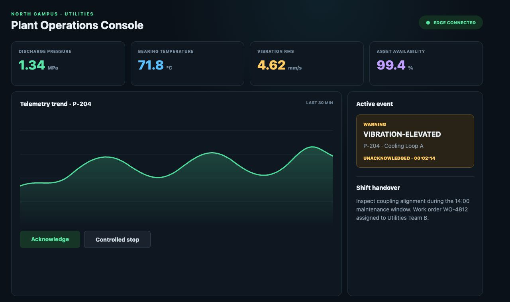
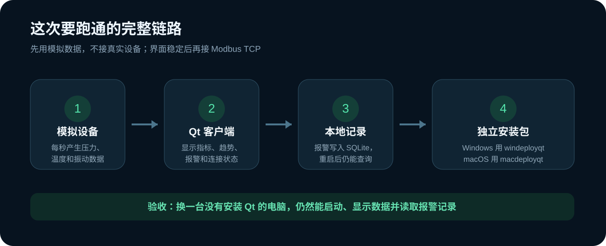
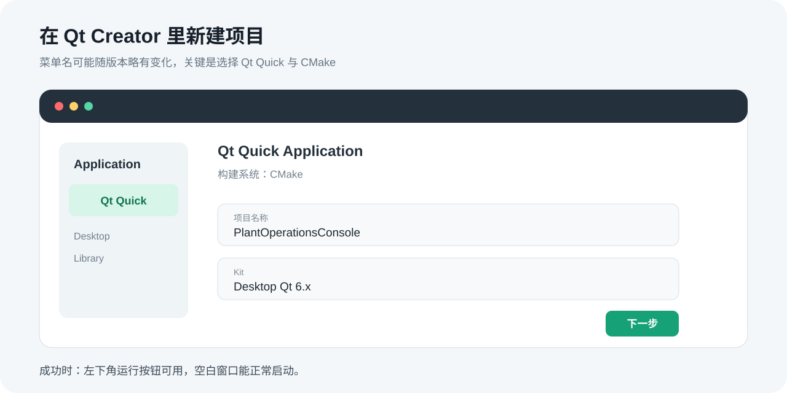
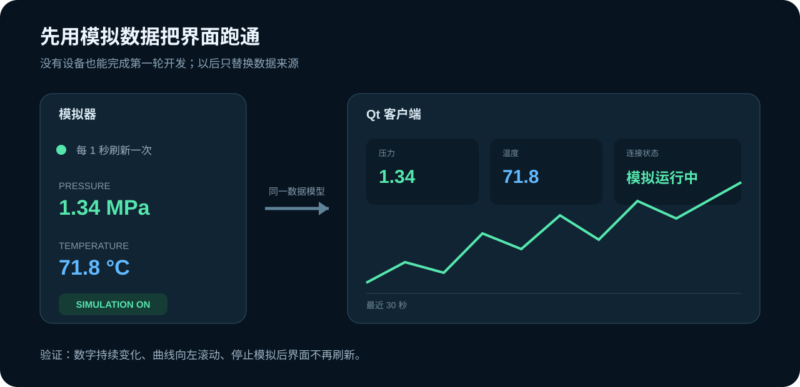
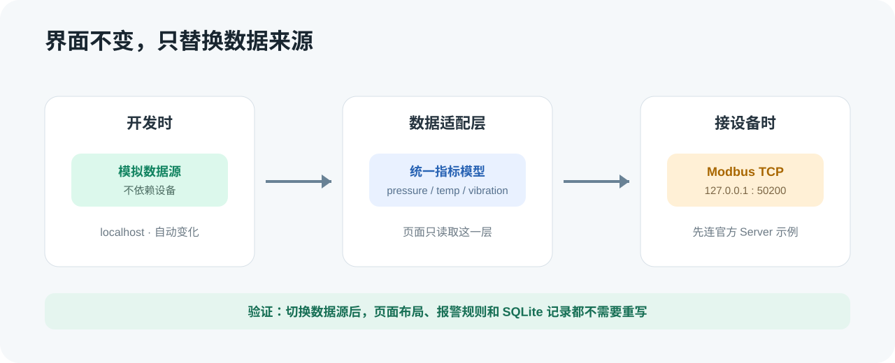
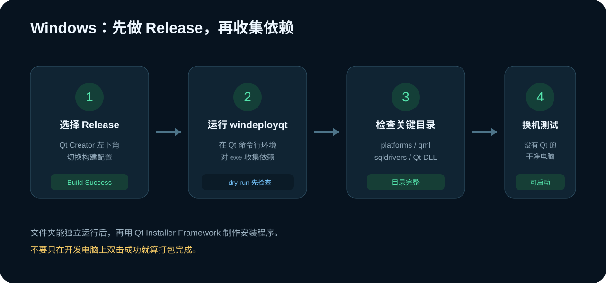
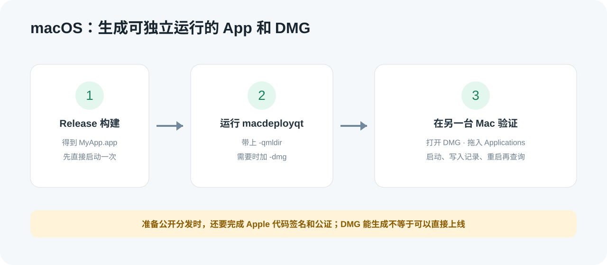

# 用 Qt 做一个企业设备运营客户端

这一篇做一个可以在 Windows 和 macOS 运行的桌面客户端：**Plant Operations Console**。

它会显示设备压力、温度、振动和连接状态，保留最近一段时间的趋势，出现异常时生成报警，并把记录保存在本机。最后我们会把它打包，在没有安装 Qt 的电脑上验证。

企业里常见的 Qt 软件不只有工厂 HMI。医疗设备工作站、机器人控制台、车队监控、实验室仪器、门店设备管理、能源站运营台，都在用相似的结构：一边连接设备或服务，一边给操作人员提供稳定的桌面界面。

下面是这次要做出的成品：



这只是教学项目。页面上的“受控停止”不会直接控制真实设备。真正接入生产设备前，还要补齐账号权限、操作审批、安全联锁、审计、断网策略和硬件测试。

## 1. 先把整条链路看明白

我们先用模拟数据完成界面和报警，再接 Qt 官方的 Modbus 示例。这样即使手边没有 PLC、传感器或采集卡，也能把整个项目做完。



这里有三个部分：

- 数据源负责提供压力、温度和振动数据。
- Qt 客户端负责展示、判断报警和接收操作。
- SQLite 负责保存报警记录，应用重启后还能查询。

先不要急着接真实设备。界面、数据模型和报警规则稳定以后，再把模拟数据源换成 Modbus TCP、OPC UA 或企业已有的接口，会轻松很多。

## 2. 准备 Qt 开发环境

打开 [Qt Online Installer](https://www.qt.io/download-qt-installer-oss)，安装当前 Qt 6 桌面版本和 Qt Creator。选择组件时至少保留：

- 与电脑匹配的 Desktop Kit；
- Qt Quick；
- Qt Serial Bus；
- Qt Charts。

SQLite 驱动通常会随桌面版 Qt 一起安装。后面打包时，我们仍会检查它有没有被带上。

安装完成后，打开 Qt Creator，选择“文件 → 新建项目”，新建一个 **Qt Quick Application**，构建系统选择 **CMake**，项目名填写 `PlantOperationsConsole`。



点击左下角的绿色运行按钮。先确认空白应用能启动，再交给 AI 修改。

看到一个独立窗口，并且 Qt Creator 的“应用程序输出”没有红色错误，就说明环境正常。

如果这里都跑不起来，先把错误交给 AI：

> 我的空白 Qt Quick 项目运行失败，错误是【粘贴错误】。请只修复这个错误，并告诉我修完后点哪里验证。

## 3. 先做出能运行的第一版

在 Trae、Cursor 或其他能读取当前项目的 AI 工具里打开这个目录，然后说：

> 请把当前 Qt Quick 项目改成设备运营客户端。首页显示压力、温度、振动、连接状态、最近趋势和当前报警，先使用每秒变化的模拟数据。完成后告诉我怎样在 Qt Creator 里运行。

第一轮只要一个页面，不要同时要求登录、报表、权限和真实设备接入。AI 改完以后回到 Qt Creator，重新配置 CMake，再点击运行。

这一步需要看到：

- 四个指标卡片；
- 一条会持续移动的趋势线；
- 清楚的“模拟运行中”状态；
- 窗口缩放后主要内容仍然可见。



如果界面看起来太拥挤，不要重新发一大段设计要求，直接说：

> 现在只调整首页布局：窗口变窄时不要遮挡数字和按钮，颜色与现有界面保持一致。

## 4. 把模拟数据做成可以切换的来源

现在的数字只是为了验证界面。下一步让 AI 把数据来源单独拆开：

> 请把模拟数据从页面里拆出来，做成独立数据源。页面只读取统一的压力、温度、振动和连接状态，暂时不要改界面。

运行后，数字和曲线应该和之前一样变化。这个结果很重要：它说明页面不再关心数据到底来自模拟器还是设备。



### 4.1 用 Qt 官方示例模拟 Modbus 设备

安装了 Qt Serial Bus 后，可以直接使用 Qt 自带的 Modbus Server 示例，不需要购买第三方模拟软件。

在 Qt Creator 欢迎页进入“示例”，搜索 **Modbus Server**，打开并运行。把连接方式设为 Modbus TCP，地址使用 `127.0.0.1`，端口使用 `50200`。

我们使用 `50200`，是为了避免系统对低端口的权限限制，也和 Qt 官方示例的默认做法保持一致。

Server 连接成功后，回到自己的项目，继续说：

> 请给现有数据源增加 Modbus TCP 模式，使用 QModbusTcpClient 连接 127.0.0.1:50200。连接失败时保留错误提示，并允许我切回模拟模式。

重新运行客户端，先启动 Server，再点击连接。成功时需要看到：

- 客户端显示“Modbus 已连接”；
- 修改 Server 里的寄存器后，页面指标会变化；
- 关闭 Server 后，客户端显示断开，不会卡死；
- 再次启动 Server 后可以重新连接。

如果连接不上，把两边界面和错误一起交给 AI：

> Modbus Server 已连接 127.0.0.1:50200，但客户端报错【粘贴错误】。请只检查地址、端口、设备 ID 和寄存器范围。

## 5. 增加报警和本地记录

接下来只做报警：

> 请增加报警规则：温度或振动超过阈值时显示黄色或红色报警，恢复正常后保留历史记录。阈值集中配置，不要散落在页面里。

为了验证，不要等模拟数据碰巧超限。临时把阈值调低，确认报警出现，再改回正常值。

报警至少要显示时间、设备、指标、数值、等级和处理状态。只有一行“温度过高”还不够，因为值班人员以后无法知道它什么时候发生、是否已经处理。

报警能正常出现以后，再让 AI 保存记录：

> 请把报警保存到本地 SQLite。应用重启后仍能查看，重复报警不要每秒写一条。

验证时按这个顺序操作：

1. 调低阈值，等一条报警出现。
2. 在历史页确认它已经写入。
3. 关闭应用，再重新打开。
4. 确认刚才的记录仍然存在。

如果重启后记录消失，提示词也保持简单：

> 应用重启后报警记录消失了。请检查 SQLite 文件保存位置和建表过程，只修复持久化问题。

## 6. 增加受控操作演示

运营客户端通常还需要下发操作，但教学项目不能把按钮直接接到真实设备。

先做一个安全的演示流程：

> 请把“受控停止”做成演示操作。点击后先确认原因，再显示执行结果，并把操作人、时间、原因和结果写入本地记录；不要连接真实设备。

成功时，误点一次按钮不会立刻改变设备状态，取消后也不会留下“执行成功”的记录。

真正接设备时，至少还需要权限校验、安全联锁、超时、失败回滚和操作审计。这些应由负责设备安全的团队一起设计，不能只靠页面弹窗。

## 7. 在 Qt Creator 里做一次完整验收

打包前先走一遍：

1. 启动应用，确认模拟数据持续变化。
2. 触发一条报警，确认颜色、文字和历史记录都正确。
3. 重启应用，确认记录还在。
4. 启动 Qt Modbus Server，切到 Modbus 模式。
5. 修改寄存器，确认页面值随之变化。
6. 关闭 Server，确认客户端能提示断开并允许重连。
7. 试一次受控操作，确认取消和执行会留下不同结果。

有一项失败，就先修这一项：

> 验收第【几】步失败了，现象是【描述现象】。请只修复这一项，不改已经通过的功能。

## 8. Windows 打包：windeployqt

Qt Creator 里能运行，不代表发给别人也能运行。开发电脑已经安装了 Qt，很多缺少的依赖会被自动找到；干净电脑不会。

先在 Qt Creator 左下角把构建配置切到 **Release**，重新构建。找到生成的 `.exe`，先在构建目录里运行一次。

然后打开 Qt 安装目录提供的命令行环境。通过 Online Installer 安装的 Qt，可以先运行对应工具链的 `qtenv2.bat`，再进入 Release 输出目录。

先检查工具准备复制哪些文件：

```powershell
windeployqt --dry-run --release --qmldir <你的-qml-目录> PlantOperationsConsole.exe
```

确认路径正确后正式执行：

```powershell
windeployqt --release --qmldir <你的-qml-目录> PlantOperationsConsole.exe
```

如果项目没有单独的 QML 目录，把 `--qmldir` 指向包含 QML 文件的项目目录。



执行后检查输出目录里至少有：

- 应用的 `.exe`；
- Qt 运行库；
- `platforms/qwindows.dll`；
- QML 依赖目录；
- 使用 SQLite 时所需的数据库驱动。

不要把这个文件夹留在原位置验证。把整个目录复制到一台没有安装 Qt 的 Windows 电脑或干净虚拟机，再运行。

成功标准不是“窗口能打开”，而是模拟数据、趋势、报警和 SQLite 记录都能正常使用。

常见的 `no Qt platform plugin could be initialized`，通常说明 `platforms` 目录没有带全。可以这样问 AI：

> 打包后的程序报错【粘贴错误】。这是 windeployqt 输出目录，请告诉我缺哪个插件，并给出最短的重新打包命令。

文件夹独立运行以后，再考虑 [Qt Installer Framework](https://doc.qt.io/qtinstallerframework/) 的 `binarycreator` 制作安装向导。安装器不能修复缺失依赖，所以不要把顺序反过来。

## 9. macOS 打包：macdeployqt

同样先切到 **Release**，构建出 `PlantOperationsConsole.app`，并在本机启动一次。

进入输出目录后执行：

```bash
macdeployqt PlantOperationsConsole.app -qmldir=<你的-qml-目录>
```

需要同时生成 DMG 时执行：

```bash
macdeployqt PlantOperationsConsole.app -qmldir=<你的-qml-目录> -dmg
```



把 DMG 复制到另一台没有安装 Qt 的 Mac，拖入 Applications 后再测试：

- 能否启动；
- 模拟数据和曲线是否正常；
- 是否能写入报警；
- 重启后是否能查到记录。

准备公开分发时，还要按 Apple 的要求完成代码签名和公证。`macdeployqt -dmg` 只负责整理依赖和制作镜像，不等于已经可以绕过系统安全检查上线。

## 10. 最后检查

做到下面这些，这篇教程才算真正跑通：

- 空白 Qt Quick 项目可以运行；
- 模拟数据会持续刷新；
- 界面不直接依赖模拟器；
- Qt Modbus Server 修改寄存器后，客户端数值会变化；
- 断开连接时界面不会卡死；
- 报警有时间、等级、数值和处理状态；
- SQLite 记录在重启后仍然存在；
- 受控操作需要确认，并有结果记录；
- Windows 或 macOS 安装包在没有 Qt 的电脑上通过验证。

后续要接真实设备时，只换数据源和控制适配层，不要把页面重新做一遍。准备进入生产环境时，再补账号权限、加密通信、配置签名、审计、备份、硬件在环测试和适用的行业认证。

## 参考资料

- [Qt Deployment 官方文档](https://doc.qt.io/qt-6/deployment.html)
- [Qt for Windows - Deployment](https://doc.qt.io/qt-6/windows-deployment.html)
- [Qt for macOS - Deployment](https://doc.qt.io/qt-6/macos-deployment.html)
- [Qt Modbus Client 官方示例](https://doc.qt.io/qt-6/qtserialbus-modbus-client-example.html)
- [Qt Serial Bus](https://doc.qt.io/qt-6/qtserialbus-index.html)
- [Qt Installer Framework](https://doc.qt.io/qtinstallerframework/)
- [Qt 在自动化软件中的应用](https://www.qt.io/development/qt-in-automation)
