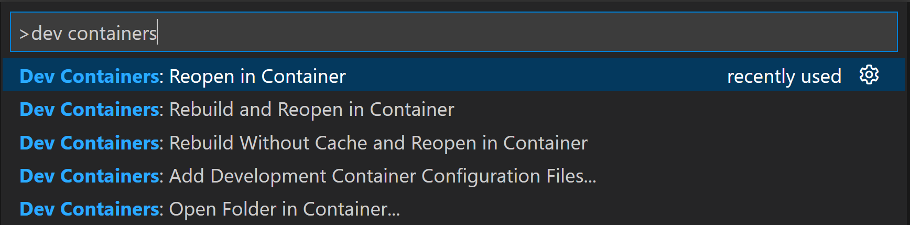
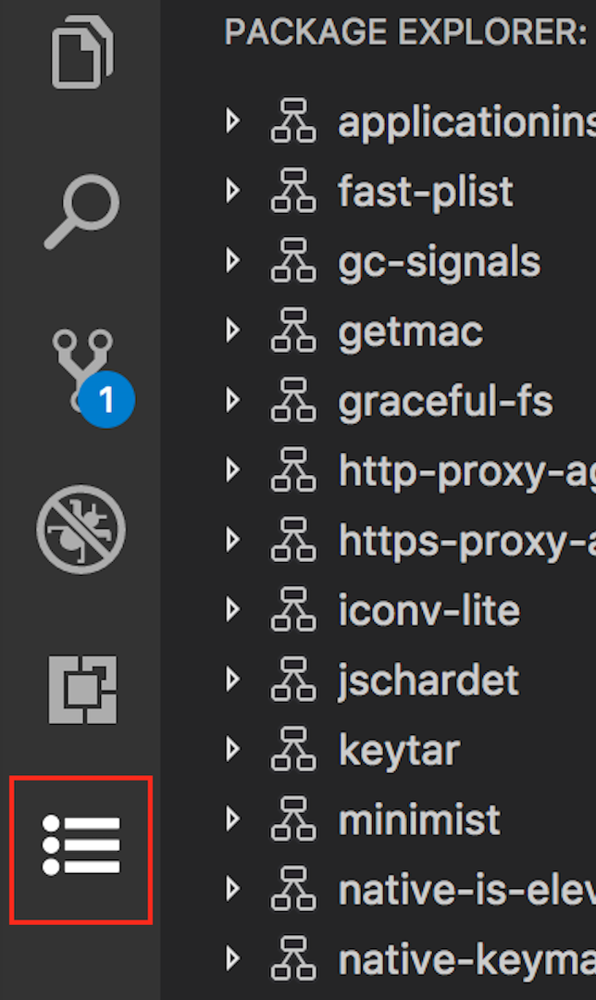
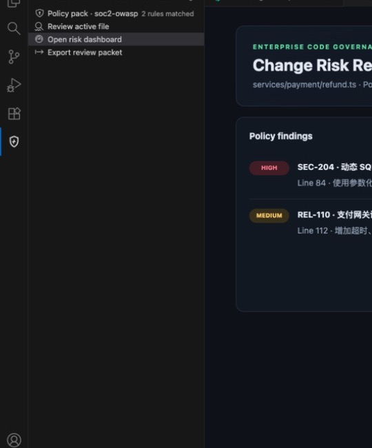
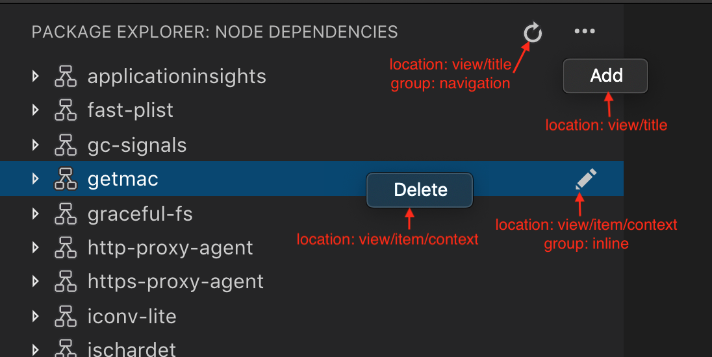
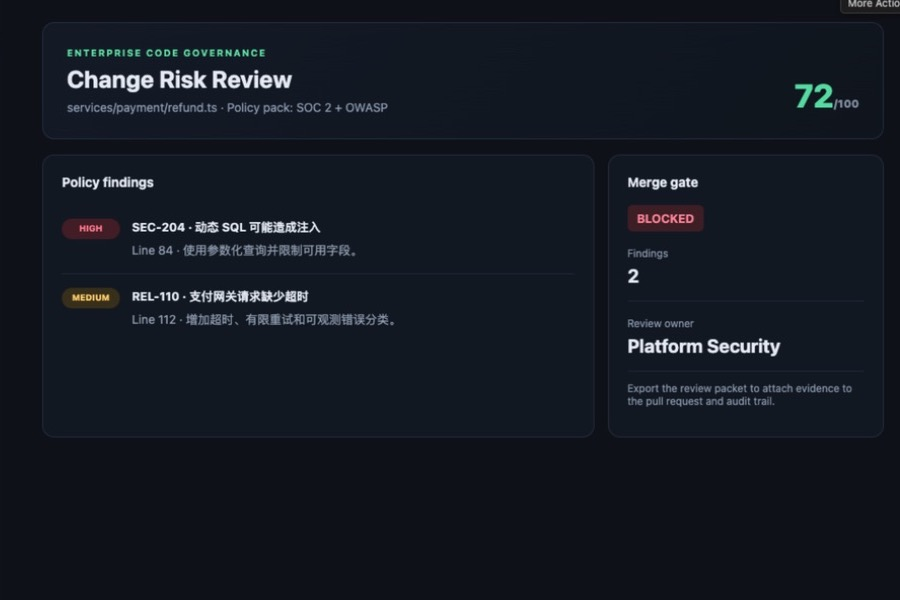

# 用 VS Code 插件把团队规则放进编辑器

你好，欢迎继续来到多平台开发这一章。

如果你每天都在 VS Code 里写代码，应该已经装过不少插件。代码补全、格式化、Git、容器、数据库和远程开发，很多原本需要切换到其他软件的操作，现在都能直接留在编辑器里完成。

企业自己做插件也是同一个思路：不是重新造一个编辑器，而是把项目模板、代码规范、安全检查、工单和发布流程放到开发者每天都打开的地方。

## 企业里的 VS Code 插件都在做什么

先看几个真实产品。

[GitHub Pull Requests and Issues](https://marketplace.visualstudio.com/items?itemName=GitHub.vscode-pull-request-github) 可以在 VS Code 里查看 Pull Request、评论代码、切换分支和处理 Issue；[Dev Containers](https://marketplace.visualstudio.com/items?itemName=ms-vscode-remote.remote-containers) 会按照项目配置启动统一的容器开发环境；[ESLint](https://marketplace.visualstudio.com/items?itemName=dbaeumer.vscode-eslint) 则把规则检查结果直接显示在代码和 Problems 面板里。

下面是微软 Dev Containers 插件的真实命令面板。它没有重新设计一套窗口，而是把“在容器中重新打开项目”做成普通 VS Code 命令：

图片来源：[Visual Studio Code Dev Containers](https://marketplace.visualstudio.com/items?itemName=ms-vscode-remote.remote-containers)。

公司内部常见的插件也很具体：创建符合规范的新项目、检查依赖版本、查询当前服务负责人、打开内部文档、提交工单，或者在发布前确认代码是否满足安全规则。它们不一定需要 AI，先把重复流程做得稳定，通常就已经很有价值。

## 这次做什么

这一篇做一个本地代码检查插件：**Engineering Guard**。

它会检查当前文件里的三类问题：疑似硬编码凭证、没有超时的网络请求和字符串拼接 SQL。结果进入侧边栏和问题列表，点击以后可以回到对应代码。第一版不调用模型、不上传源码，也不需要 API Key。

这是 Engineering Guard 在 Extension Development Host 中的运行画面：

先把边界说清楚：这不是一套真正的企业安全平台，也不能替代专业的 SAST、依赖扫描和代码审查。它只是用一个容易验证的小例子，带你跑通命令、规则、侧边栏、菜单、状态栏和 VSIX 打包。

## 插件是怎样进入 VS Code 的

普通桌面插件运行在 Extension Host 中。VS Code 负责编辑器、命令面板、侧边栏和状态栏，插件通过 Extension API 注册自己的功能。这样一个插件出错时，不应该把整个编辑器主界面一起拖死。

`package.json` 负责告诉 VS Code“有哪些命令和界面入口”，插件入口负责真正执行检查，Tree View 或 Problems 面板负责把结果展示出来。

微软官方的 Tree View 示例就是这种结构。下面是真实的 References 结果视图：文件是父节点，具体命中位置是子节点，点击后回到代码。

图片来源：[VS Code Tree View API](https://code.visualstudio.com/api/extension-guides/tree-view)。Engineering Guard 的问题列表也采用同样的原生交互，不需要为了显示几行结果就先做复杂 Web 页面。

## 1. 创建一个能调试的插件

电脑先安装 Node.js 当前 LTS 版本和 VS Code。新建一个空目录，用 VS Code 打开，然后对 AI 说：

> 请用 VS Code 官方生成器创建 TypeScript 插件，名称叫 Engineering Guard。完成后告诉我怎样按 F5 调试。

创建完成后先不要加业务功能。按 F5，VS Code 会再打开一个带有 **Extension Development Host** 标记的窗口。这个新窗口是插件的测试环境，原来的窗口继续显示代码和调试日志。

如果 F5 没有打开测试窗口，把错误交给 AI：

> 按 F5 后插件没有启动，错误是【粘贴错误】。请只修复调试配置。

看到默认 Hello World 通知以后再继续。第一步只确认项目、编译和 Extension Host 已经连通。

## 2. 先增加一条命令

把默认命令换成“检查当前文件”：

> 请增加“Engineering Guard: 检查当前文件”命令。运行后先显示当前文件名。

重新按 F5，在测试窗口中打开任意代码文件，再从命令面板运行这条命令。

这里要检查两个结果：打开文件时，通知里的文件名正确；没有打开文件时，插件提示“请先打开文件”。如果这两个状态都正常，说明插件已经能读取编辑器上下文。

## 3. 加入三条本地规则

命令跑通后再做扫描：

> 请检查疑似硬编码密钥、没有超时的网络请求和字符串拼接 SQL。只扫描当前文件，不上传代码。

准备一个专门的测试文件，每种问题只放一处。运行检查后，三条规则都应该出现；修改其中一处再检查，对应问题应该消失。

规则不要一次增加几十条。企业代码检查最怕“什么都报”，最后所有人都学会忽略。先让每一条规则都有清楚的命中条件、位置和修改建议。

## 4. 把结果放进侧边栏和 Problems

现在让检查结果离代码更近：

> 请把结果显示在 Problems 和 Engineering Guard 侧边栏。点击问题时跳到对应文件和行号。

侧边栏先处理四种状态：还没检查、没有问题、发现问题、原文件已经关闭。空状态也要告诉用户下一步做什么，不能只留一块空白。

VS Code 官方 Tree View 指南给出了独立活动栏入口的真实效果：

图片来源：[VS Code Tree View API](https://code.visualstudio.com/api/extension-guides/tree-view)。

Engineering Guard 的实际界面中，左侧保留检查入口，右侧显示命中的规则和风险等级：

## 5. 增加菜单和状态栏

检查命令不应该只能从命令面板找到。继续增加两个入口：

> 请在编辑器右键菜单增加“检查选中代码”，没有选中内容时不显示。

再给资源管理器增加文件检查：

> 请在资源管理器右键菜单增加“检查这些文件”，跳过图片、依赖目录和超大文件。

VS Code 的原生菜单可以出现在视图标题、列表项和右键菜单中。官方示例把这些位置标得很清楚：

图片来源：[VS Code Tree View API：View Actions](https://code.visualstudio.com/api/extension-guides/tree-view#view-actions)。

最后增加一个安静的状态栏入口：

> 请在状态栏显示最近一次检查结果，点击后打开侧边栏。

状态栏只需要显示“未检查”“通过”或问题数量，不要闪烁，也不要一直弹通知。

## 6. 检查结果要让人看得懂

现在从测试文件触发三条规则，确认文件名、行号、严重程度和建议都正确。最终结果应该类似下面这样：

这里最重要的不是风险分数，而是每一条结果都能回答三个问题：哪里有问题、为什么有风险、下一步应该做什么。点击问题还要回到对应代码，不能让用户自己搜索行号。

## 7. AI 能力放到最后

本地规则完整跑通以后，才考虑让模型解释问题或生成修复建议。AI 不应该成为“能不能检查代码”的前置条件。

> 请增加一个可选的解释入口，只解释当前选中的检查结果。没有模型权限时，本地检查继续工作。

发送代码前要明确告诉用户会包含哪些内容。企业版本还要遵守仓库权限、组织策略和数据边界，不能默认把整个项目上传给外部服务。

## 8. 从头验收一次

不要只看最后一张漂亮页面。重新加载 Extension Development Host，然后依次检查：

1. 命令面板可以找到“检查当前文件”；
2. 无问题文件显示通过；
3. 测试文件能稳定命中三条规则；
4. 点击侧边栏和 Problems 结果能回到正确行；
5. 编辑器右键和资源管理器多选都能运行；
6. 修复代码后，旧问题会消失；
7. 禁用模型能力后，本地检查仍然可用；
8. 重新加载窗口后，命令、视图和状态栏仍然存在。

某一步失败时，只描述这一项：

> 第【几】步失败，现象是【描述】。请只修复这一项。

## 9. 打包成 VSIX

开发窗口里能运行，还不等于别人能安装。先补齐插件名称、版本、图标、仓库、许可证和隐私说明，然后对 AI 说：

> 请用 VS Code 官方 vsce 工具打包 VSIX，并排除测试数据和无关文件。

生成 VSIX 后，换一个 VS Code 配置或另一台电脑，选择“Install from VSIX”，再跑一遍命令、规则、侧边栏和定位功能。

公司内部不一定要发布到公开 Marketplace。VSIX 可以放在内部制品库，也可以通过组织的软件分发方式安装。真正准备公开发布时，再按照当前的 [VS Code 发布文档](https://code.visualstudio.com/api/working-with-extensions/publishing-extension)创建发布者并提交。

## 10. 做完以后，你掌握了什么

到这里，我们已经跑通了一条完整的插件链路：

**VS Code 命令 → 读取当前文件 → 本地规则 → Problems / Tree View → 菜单和状态栏 → VSIX。**

它还不是企业级代码安全产品，但已经可以继续替换真实规则。以后可以接入公司的项目模板、规则服务、代码负责人、工单系统或发布门禁，同时保留最重要的原则：用户知道插件读了什么、错误能定位、离线功能不会因为模型不可用而失效。

## 参考资料

- [VS Code Extension API](https://code.visualstudio.com/api)
- [Your First Extension](https://code.visualstudio.com/api/get-started/your-first-extension)
- [Extension Anatomy](https://code.visualstudio.com/api/get-started/extension-anatomy)
- [Tree View API](https://code.visualstudio.com/api/extension-guides/tree-view)
- [VS Code UX Guidelines：Views](https://code.visualstudio.com/api/ux-guidelines/views)
- [GitHub Pull Requests and Issues](https://marketplace.visualstudio.com/items?itemName=GitHub.vscode-pull-request-github)
- [Visual Studio Code Dev Containers](https://marketplace.visualstudio.com/items?itemName=ms-vscode-remote.remote-containers)
- [ESLint for VS Code](https://marketplace.visualstudio.com/items?itemName=dbaeumer.vscode-eslint)
- [发布 VS Code 插件](https://code.visualstudio.com/api/working-with-extensions/publishing-extension)
