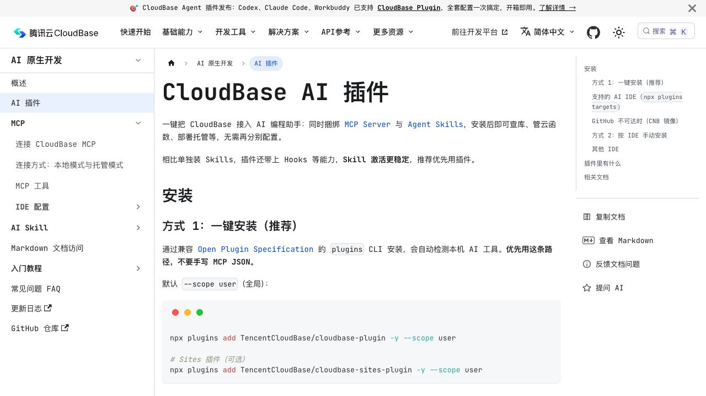
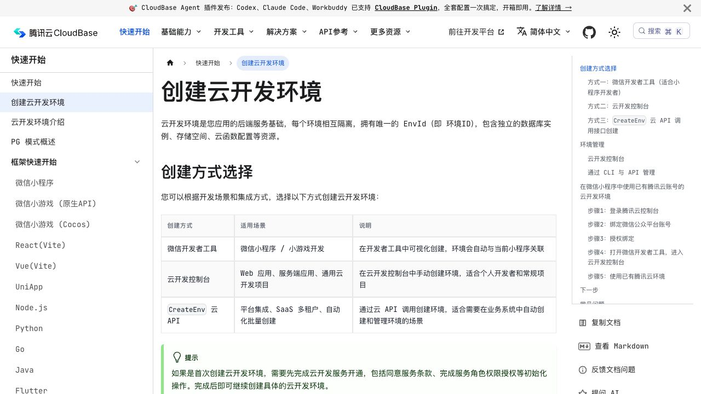
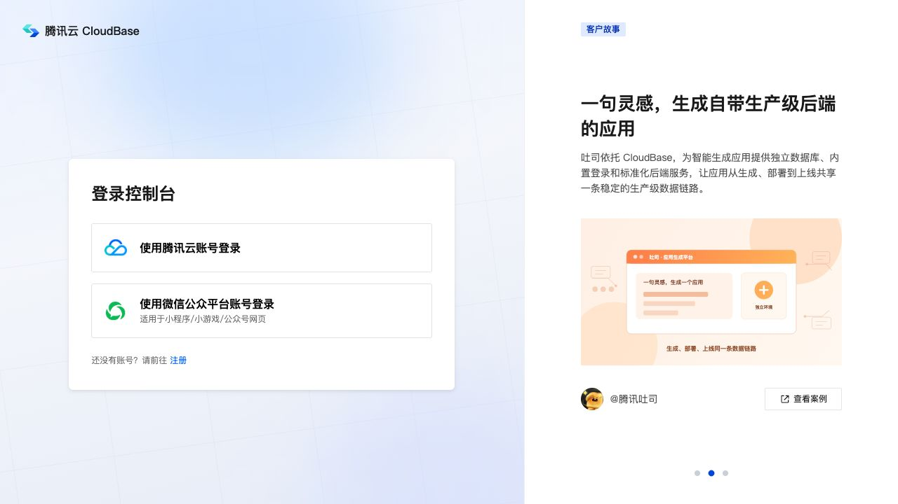

# 如何构建一个带后端的微信小程序

# 1. 什么是带后端的微信小程序开发

在上一节里，我们已经用 Trae、HBuilderX 和微信开发者工具，做出了一个可以在微信里运行的贪吃蛇小程序。

但这时候，所有内容还只存在当前手机和当前页面里。如果用户换一台手机，之前的数据就找不到了；如果两个人同时使用，小程序也不知道哪一条记录属于谁；如果以后要接会员、订单、文件上传，单靠前端页面也没有办法安全地完成。

所以这一节，我们继续沿着上一节的方式往前走：页面还是让 AI 帮我们做，但这一次，我们要给它接上真正的后端。

开始动手之前，我们需要先搞清楚两个问题。

第一个是 **后端到底帮小程序做什么**。哪些事情可以留在页面里，哪些事情必须交给云端处理？

第二个是 **第一次接触后端的人，怎样用最短的路径把它跑起来**。工具在哪里打开、要对 AI 说什么、成功以后应该在屏幕上看到什么？

搞清楚这两个问题以后，我们就可以打开上一节的项目，给它加上用户身份、云端数据和售后工单了。

## 1.1 带后端的小程序多了什么

你可以把小程序前端理解成一个“服务窗口”。用户在窗口里填写信息、点击按钮、查看结果；但窗口本身不会决定这张工单属于谁、谁有权限修改、数据应该保存多久。

真正处理这些事情的，是后端。

比如用户点击“提交工单”以后，后端需要先确认当前是谁，再检查内容是不是完整，然后把工单保存到云端。用户下一次打开小程序时，后端还要只把属于他的记录返回回来。

同样的道理，下面这些事情也不能为了省事直接放在前端：

- AppSecret、支付密钥、AI Key 等真正的密钥；
- 用户身份、管理员权限和工单归属；
- 价格、库存、积分、订单状态等关键规则；
- 内容审核、操作日志和防止重复提交。

一句话理解：**前端负责让用户操作，后端负责让业务可信。**

## 1.2 这一次我们要做什么

上一节我们做的是贪吃蛇，这一次，我们换一个企业里更常见的例子——**Northstar Service Hub**。

它是一个“会员 + 售后工单”小程序。用户打开首页以后，可以看到会员状态、常用服务和最近工单；遇到问题时，可以填写描述、上传图片，再查看后续处理进度。

这个例子不只适合某一个行业。你可以把它改成零售品牌的会员中心、酒店的住客报修、汽车品牌的车主服务、保险公司的材料补交入口，或者消费电子产品的维修进度查询。

你平时在微信里见到的品牌会员中心，大多也是这种思路：小程序负责让用户快速打开和操作，真正的订单、积分和售后记录则交给后端处理。

比如 2026 夏季达沃斯的官方小程序，就把会议信息、直播和互动服务放进了微信；Starbucks China 的小程序里，则有点单、会员权益、商品和门店这些入口。你可以看看 Tencent 的[夏季达沃斯微信小程序案例](https://www.tencent.com/en-us/articles/2202375.html)和[微信品牌保护报告](https://static.www.tencent.com/attachments/reports/tencent_bpp_report_2023.pdf)，大致了解大家通常会把哪些服务放进小程序。

## 1.3 小程序后端的几种做法

真正给小程序接后端时，大家采用的路线并不完全一样。为了避免你一上来就被云函数、容器、数据库和网关这些名词淹没，我们仍然只做一个粗略分类。

第一种方式，是使用 **微信·云开发 / CloudBase 原生能力**。小程序直接调用云函数，云函数再去操作文档型数据库和云存储。这条路线和微信身份结合得最近，不需要你第一天就自己搭登录系统、买服务器和配置 HTTPS。

第二种方式，是使用 **CloudBase 云托管**。等项目以后需要同时服务小程序、网页和管理后台，或者已经有 Express、NestJS、FastAPI 这类完整后端时，再考虑这条路。

第三种方式，是接入企业原来就有的后端。腾讯云现在可以用 AnyService 把已有服务接进小程序；如果公司本来就有后端团队，不需要为了小程序再重做一套。

如果你在文档里还看到“HTTP 网关”，先别把它和 AnyService 当成同一个东西。AnyService 负责连接公司原来的服务，HTTP 网关主要给 CloudBase 里的云函数和云托管提供 HTTP 访问入口。

这三条路并不是谁一定更高级。对第一次做带后端小程序的人来说，我们先选择最容易跑通的一条：

**微信·云开发原生环境 → 云函数 → 文档型数据库 / 云存储。**

腾讯云现在还支持 PostgreSQL。你只需要先知道还有这条路即可，等以后真的遇到复杂关联、SQL 或强事务需求时，再回来考虑它。

这里有一个限制：PostgreSQL 只能在新建环境时选择，原来的传统环境不能直接切换，微信开发者工具当前也不能创建。真要使用，需要去 CloudBase 控制台新建环境，再迁移数据和调整接入方式。

这一次，我们先不增加这层难度。

## 1.4 腾讯云目前推荐的 AI 开发方式

如果你现在打开腾讯云最新版文档，会看到一个新的入口——**CloudBase AI 插件**。你可以把它理解成一个打包好的 AI 开发工具，一次帮你接上 MCP Server、Agent Skills 和 Hooks。你的 AI 工具如果已经支持一键安装，就优先选择这个入口。

你可以把这套插件理解成专门给 AI 准备的“云开发说明书和操作工具”。接好以后，AI 不只是知道怎样写页面，还能按照 CloudBase 当前的规范理解云函数、微信身份、数据库权限和部署流程。

这一篇继续使用 Trae。腾讯云当前给 Trae 的专门指南，仍然是先接入 CloudBase MCP，再按需要安装和读取 Skills，所以后面的操作沿用这条路线。以后 Trae 支持一键插件时，再直接换成插件即可，不需要两套一起安装。

这里需要注意一个容易混淆的名字：`mp-skills` 是把小程序业务能力开放给微信 AI 调用的另一套工具，并不是普通小程序接后端时必须安装的东西。这一章只使用 CloudBase 开发相关 Skills，不把两条路线混在一起。

# 2. 环境准备

如果你已经完成上一节，这一次不需要重新安装所有软件。我们继续使用原来的项目，只多准备 CloudBase 这一块。

## 2.1 本教程会用到的四个工具

整个 Northstar Service Hub 的开发，我们会同时用到四个工具，它们各自负责不同的环节：

1. 第一个是 **Trae**。它仍然负责打开真实项目、和 AI 对话、修改文件。不同的是，这一次我们还会让它连接 CloudBase MCP。
2. 第二个是 **HBuilderX**。它继续负责 uni-app 项目的构建，把源项目运行到微信小程序模拟器。
3. 第三个是 **微信开发者工具**。除了预览页面，它还负责开通云开发、查看环境、部署云函数和上传版本。
4. 第四个是 **CloudBase 控制台**。你会在这里看到数据库记录、云函数日志、存储文件和环境状态。

简单总结一下：Trae 帮你和 AI 一起开发，HBuilderX 帮你构建，微信开发者工具帮你运行，CloudBase 控制台帮你确认后端真的工作了。

## 2.2 确认小程序账号和 AppID

开始接后端之前，先回到微信公众平台确认一次 AppID。

这一步和上一节完全相同：打开[微信公众平台](https://mp.weixin.qq.com/)，进入“开发管理 → 开发设置”，找到小程序唯一的 AppID。

接着检查 HBuilderX 项目里的 AppID 是否和它一致，再确认微信开发者工具登录的是有这个小程序开发权限的账号。

如果 AppID 填错，后面最常见的现象就是：看不到正确的云环境，或者上传后的版本出现在另一个项目里。遇到这类问题时，不要急着让 AI 重写代码，先把小程序身份确认好。

## 2.3 在 Trae 中接入 CloudBase MCP 和 Skills

CloudBase 整体优先推荐一键插件，但这一篇使用的是 Trae，所以我们按照腾讯云当前的 Trae 专门指南接入 MCP 和 Skills。

打开腾讯云官方的 [Trae 配置指南](https://docs.cloudbase.net/ai/cloudbase-ai-toolkit/ide-setup/trae)，按照页面说明在 Trae 的 MCP 设置中加入 CloudBase。第一次使用时，优先选择官方的登录和环境选择流程，不要为了省一步把 SecretID、SecretKey 或 CloudBase API Key 粘贴进提示词。

连接完成以后，我先没有急着让 AI 做页面，而是对它说：

> 请先确认当前 CloudBase 环境是否连接成功，并告诉我当前选中的是哪个环境。
>
> 这是一个微信小程序 + CloudBase 项目，请先读取 miniprogram-development，再按需要读取 auth-wechat、cloud-functions、数据库权限和云存储相关 Skills。
>
> 这一轮只检查环境和项目，不要修改功能。

如果 AI 能正确识别当前项目类型、当前环境，并告诉你接下来会用哪些 Skills，就说明这一层已经准备好了。

如果你的 Trae 暂时不能使用 MCP，也不用紧张。后面的提示词仍然可以直接使用，只是部署、查看日志和数据库这些操作需要你自己在控制台中完成。

## 2.4 在微信开发者工具中开通云开发

打开上一节的项目，然后找到微信开发者工具顶部的“云开发”入口。

腾讯云当前的创建环境指南会先让你根据场景选择入口。微信小程序从微信开发者工具里创建，环境会自动和当前小程序关联。

如果你从 CloudBase 控制台进入，会先看到下面的登录页。这里可以使用腾讯云账号，也可以使用当前小程序所属的微信公众平台账号登录。

第一次点击时，开发者工具会引导你创建环境。环境名称可以写成容易辨认的名字，例如 `northstar-dev`。

这里不要把环境名称、环境 ID 和 AppID 混在一起：

- AppID 是小程序的身份；
- 环境名称是给人看的名字；
- 环境 ID 是这个后端环境的唯一编号。

开始创建以后，平台通常需要几分钟初始化资源。只要最后能进入环境总览，并看到数据库、云函数和存储入口，就说明创建成功。

正式项目一般会把开发、测试和生产环境分开。现在为了跑通教程，我们先只使用开发环境，不需要为了截图额外创建可能产生费用的环境。

## 2.5 打开上一节的基础项目

环境创建完成以后，回到 HBuilderX 和 Trae，打开上一节已经能运行的小程序项目。确认你修改的是源项目，而不是 HBuilderX 自动生成的 `unpackage` 编译结果。

然后先运行一次原项目：

1. 在 HBuilderX 中选择“运行 → 运行到小程序模拟器 → 微信开发者工具”；
2. 等待输出区域显示编译完成；
3. 确认原来的页面还可以正常打开。

这一步相当于先记住“接后端之前项目是什么样子”。如果后面出现问题，你就知道是这一轮改动带来的，而不是旧环境本身已经坏了。

这一章只验证“编译到微信小程序”这一条链路。如果同一个 uni-app 项目还要运行到 H5、App 或其他小程序，后端身份和 SDK 接入方式会不同，需要再按腾讯云的 UniApp 指南分别处理。

# 3. 小程序页面开发

前面两部分，我们已经搞清楚了后端是什么，也把 CloudBase 环境准备好了。从这一节开始，正式进入实战。

和上一节一样，我们不会先把每一个页面和每一个按钮都想得非常完美。这一次仍然采用同一种方式：**先开干——让 AI 先生成一个能运行的版本，再一边看效果、一边用自然语言慢慢调整。**

## 3.1 把需求一次性说清楚：给 Trae 下第一条“总指令”

打开 Trae，载入前面已经准备好的小程序项目之后，我先没有急着让 AI 写云函数，而是先把整个产品目标告诉它：

> 请基于我当前打开的 uni-app 微信小程序项目，设计一个企业客户服务小程序，名字叫 Northstar Service Hub。
>
> 首页需要有会员状态、常用服务和最近工单；再增加“创建服务请求”和“我的工单”两个页面。第一轮先用演示数据把页面跑起来，但把数据读取集中放好，方便下一步接 CloudBase。
>
> 请直接修改当前真实项目，不要另建演示工程。开始前先告诉我准备改哪些文件，完成后再告诉我怎样在 HBuilderX 和微信开发者工具中查看结果。

也就是说，我不是让 AI 一上来就同时处理登录、数据库、上传和支付，而是先抛出一个完整目标，让它把用户能看到的第一版搭起来。

## 3.2 让 AI 自动修改代码，而不是“手搓”

Trae 收到这条指令以后，会先阅读当前项目结构，判断应该增加哪些页面、在哪里放数据访问，再直接修改真实文件。

你可以在对话区看到它的计划，也可以看到每一次文件变更。

如果你发现 AI 准备新建另一个项目，可以马上告诉它：“不要另建项目，只修改当前工作区。”

如果这一轮结果不满意，也不用紧张。Trae 仍然提供回退能力，可以把工程恢复到本次修改之前。

## 3.3 在 HBuilderX 和微信开发者工具中查看效果

AI 完成第一轮开发之后，代码已经落在项目里了，但这时候你还没有看到用户视角的效果。下一步，我们需要把它跑起来。

回到 HBuilderX，选择“运行 → 运行到小程序模拟器 → 微信开发者工具”。

底部输出窗口会显示编译过程。如果最终没有报错，就可以切到微信开发者工具查看首页、创建工单和我的工单页面。

这一轮先只看界面：按钮好不好点、表单清不清楚、空状态有没有告诉用户下一步做什么。后端还没有真正接上，所以暂时看到演示数据是正常的。

## 3.4 用自然语言继续调整页面

AI 一开始生成的页面不一定刚好符合你的想法。在我这次尝试里，我希望首页更像一个真实品牌的客户服务入口，而不是把所有功能都堆在第一屏。

所以我继续对 AI 说：

> 现在页面已经能运行了，请继续在当前项目里调整：
>
> 首页第一屏只保留会员状态、三个最常用的服务和最近一条工单；创建工单页面把“问题信息”和“联系方式”分开；所有提示都用普通用户能理解的语言，不要在页面上显示数据库或云函数术语。
>
> 修改完成后，请告诉我应该在模拟器里重点检查哪些地方。

修改完成后，再回到微信开发者工具刷新页面。如果没有立刻变化，可以先在 HBuilderX 中停止运行，再重新运行到微信小程序模拟器。

## 3.5 第一版页面效果

经过几轮 **自然语言描述 → AI 修改 → 模拟器查看 → 继续调整**，你应该先得到一个页面逻辑清楚的前端版本。

下面是本章案例的一种效果参考：

到这里，页面虽然已经像一个真实产品，但里面的工单还是演示数据。下一步，我们才让它真正保存到云端。

# 4. 小程序后端开发

前面我们已经完成了页面开发，也能在微信开发者工具中看到第一版效果。从这一节开始，我们要跑通这篇教程最重要的一条链路：

**用户点击提交 → 小程序调用云函数 → 后端识别当前用户 → 工单保存到数据库 → 页面显示工单编号。**

这一部分仍然采用提示词驱动。每次只给 AI 一个小任务，看到成功结果以后，再继续下一步。

## 4.1 先让页面成功调用一次云函数

第一次接后端时，不要马上创建十几个函数。我们先做一个最简单的连接测试。

这时候，我继续在 Trae 里对 AI 说：

> 请把当前小程序接到我已经创建好的 CloudBase 开发环境。只修改源项目，不要修改 HBuilderX 自动生成的编译目录。
>
> 先做一个最简单的 healthCheck 云函数，让首页可以点击“检查后端连接”，并看到服务正常和当前时间。完成后告诉我需要部署哪个云函数，以及成功时页面和云函数日志分别会出现什么。

AI 修改完成以后，你还需要在微信开发者工具或 CloudBase 控制台中部署这个云函数。

如果点击检查以后，页面显示“服务正常”，同时云函数日志里出现了一次调用，就说明第一条“前端 → 后端 → 返回结果”的链路已经跑通。

## 4.2 让后端知道“当前是谁”

连接跑通以后，接下来是用户身份。

这里有一个地方需要特别提醒 AI：不能让前端自己说“我是用户 A”。小程序前端提交的用户标识或“我是管理员”都可能被修改，真正可信的身份要由云函数从微信调用上下文中获取。

我继续对 AI 说：

> 现在请在已经跑通的云函数链路上增加“获取当前用户”。当前用户是谁，只能由云函数从微信可信上下文中获取，不要相信前端传来的 userId、openid 或 role。
>
> 在微信·云开发原生链路中，请使用 getWXContext() 获取当前调用者的微信身份，不要另外搭建一套自定义登录和 Token。
>
> 页面只显示需要的会员资料，不要显示完整 OpenID；日志里也不要记录完整身份标识和联系方式。完成后告诉我怎样验证前端伪造 userId 不会生效。

在微信·云开发原生链路里，大多数小程序不需要自己再搭一套登录系统。当前用户是谁，应该由云函数从微信可信上下文里识别。

## 4.3 让第一张工单真正保存下来

前面我们已经让首页成功调用了云函数，但它现在只是返回一句“服务正常”，还没有真正保存任何东西。

接下来，我们只做一件事：让用户填写一张工单，点击提交之后，把它保存到云端。先不要同时做会员积分、支付和客服后台，否则一旦出错，你很难判断问题到底发生在哪里。

这时候，我继续在 Trae 里对 AI 说：

> 请在现在的 Northstar Service Hub 项目中，把“创建服务请求”接到微信云开发。
>
> 用户填写问题类型、问题描述和联系方式后，由云函数创建一张工单。当前用户是谁，要从云函数能够信任的微信身份里获取，不要相信前端自己传来的 userId。
>
> 请直接修改当前项目，完成后告诉我需要部署哪个云函数，以及提交成功后，我应该在页面和云开发控制台里分别看到什么。

部署完成后，打开 CloudBase 的文档型数据库，在“集合管理”中找到或创建工单集合。腾讯云当前的入口说明如下：

接着在模拟器里提交一张工单。页面如果显示了工单编号，同时数据库里出现了一条记录，就说明第一张工单已经真正保存成功。

第一张工单保存成功后，我又故意快速点了两次。这时候，我继续对 AI 说：

> 现在请专门检查重复提交。让一次提交对应一个固定的 clientRequestId，网络重试时继续使用同一个编号；已经成功过时，返回原来的工单，不要再创建一张。重复请求记录还要设置合理的保存时间。
>
> 请用同一个 clientRequestId 独立请求两次：两次要返回同一个工单编号，数据库只能有一条；换成新编号后，才创建新工单。如果工单和操作日志需要一起保存，使用一次很短的服务端事务，不要把第三方接口调用放进去。

要注意，只在页面上快速点两次还不够，因为这可能只是按钮做了防重复点击。再按提示词用同一个请求编号请求两次，结果仍然只有一张工单，才说明后端也处理好了。

## 4.4 让用户只能看到自己的工单

工单保存成功以后，还有一个很重要的问题：用户 A 能不能看到用户 B 的工单？

这时候你可能会想，我已经在数据库里设置了权限，云函数里是不是就不用再检查了？答案是不行。数据库规则挡的是小程序直接操作数据；云函数就像后台真正办理业务的人，它仍然要再确认一次“这张工单是不是当前用户的”。

我继续对 AI 说：

> 请帮我完成“我的工单”页面。用户身份只能由云函数从微信的可信上下文中获取，即使前端故意传入另一个 userId，也不能看到别人的工单。
>
> 云函数保存记录时，请把可信身份主动写进归属字段。服务端写入不会自动生成 _openid，不要相信前端传来的归属值。
>
> 工单、重复提交记录和操作日志都不要允许小程序前端直接写入。云函数调用规则只开放给已认证用户，没有匹配到的操作默认拒绝；云存储也只开放业务真正需要的最小权限。完成以后，请告诉我怎样检查数据库、云函数、云存储三类权限，再用两个微信账号验证：账号 A 创建的工单，账号 B 登录后必须看不到。

这里还有一个容易踩坑的地方：通过云函数或管理端保存记录时，系统不会自动生成 `_openid`。我们已经在提示词里提醒 AI 主动写入从可信上下文取得的归属信息，不要让前端自己决定。

修改完成后，先用自己的微信提交一张工单，再把另一位同事加入体验成员，用他的微信打开体验版。如果两个账号看到的内容完全分开，就说明这一层权限已经生效。

## 4.5 接入图片凭证

文字工单稳定以后，我们再增加图片。这样就算上传出现问题，也不会影响你判断文字工单本身是否已经成功。

我继续对 AI 说：

> 请给当前工单增加图片凭证上传，文件放在 CloudBase 云存储，数据库只保存 fileID，不要把 Base64 图片直接存进数据库。
>
> 请限制图片数量、大小和类型；上传失败时保留用户已经填写的表单；后端还要确认这些图片确实属于当前用户和当前工单。完成后告诉我怎样测试大文件、错误格式和上传失败。

如果现在只是你自己和同事使用的体验版，内容审核可以先不打开。准备给真实用户使用时，再让 AI 给文字、图片、音频和文档增加审核流程：新内容先进入“待审核”，通过以后再展示，可疑内容交给人工检查。腾讯云内容审核会单独计费，确认需要以后再开启即可。

## 4.6 出现问题怎么办：继续把现象告诉 AI

AI 生成的后端也不一定第一次就能完全跑通。有时候页面看起来没有问题，真正点击提交以后，却可能遇到云函数没有部署、环境 ID 填错、数据库拒绝写入等情况。

在这些时候，不要只对 AI 说一句“提交不了”，也不要让它立刻重写整个项目。你可以把自己刚才点了什么、页面显示了什么，以及控制台里最相关的一条错误一起告诉它。

例如：

> 现在我在创建工单页面点击提交后，页面一直显示处理中。微信开发者工具里的错误是【粘贴相关错误】，云函数日志里显示【粘贴相关日志，但先删除手机号、完整 OpenID、密钥和工单正文】。
>
> 请先判断问题是在前端、环境关联、云函数部署、数据库权限还是业务校验。只做最小修复，不要重写整个项目；修改后告诉我应该去哪里重新验证。

CloudBase 当前也提供日志检索。你可以按时间、资源和关键词找到刚才那一次调用，而不是在几百行输出里盲找。当前操作入口如下：

让 AI 输出日志时，可以保留请求编号、动作、工单编号、结果、耗时和错误码，但不要记录完整 OpenID、手机号、Token、密钥和工单敏感正文。

## 4.7 最终成品与本节小结

经过一轮又一轮的 **自然语言叙述 → AI 修改 → 部署云函数 → 在前端操作 → 去数据库和日志中确认**，你最终应该得到这样一个版本：

- 用户可以看到会员首页；
- 用户可以提交一张真实工单；
- 工单会保存到云端；
- 连续点击不会创建重复工单；
- 两个微信账号只能看到各自的数据；
- 图片进入云存储，数据库只保存文件标识；
- 出现问题时，可以在日志中找到对应调用。

这一次的验证和贪吃蛇不太一样。贪吃蛇只要在屏幕上能玩就基本说明成功；带后端的小程序则要同时看两个地方：**页面上的结果**和**云端留下的记录**。

# 5. 小程序发布

前面四章，我们已经完成了从页面到后端的整个开发闭环。接下来要做的，就是把这个版本上传成体验版，让两个真实账号在手机上验证。

普通的 AppID、备案、服务类目和审核步骤与上一节相同，这里重点讲带后端版本多出来的检查。

## 5.1 上传前先检查环境

上传以前，先回到 Trae 对 AI 说：

> 请检查当前微信小程序准备上传体验版时使用的是哪个 CloudBase 环境，并确认前端代码和云函数都是最新版本。
>
> 请检查项目里有没有演示数据、调试按钮、SecretID、SecretKey、CloudBase API Key、支付密钥或第三方 API Key。真正的密钥只能放在服务端环境变量或集成中心，不能进入小程序、Git、提示词和日志。
>
> 请再检查数据库、云函数和云存储三类安全规则。教学用 healthCheck、调试按钮和不再使用的函数，如果生产环境不需要，就删除或关闭。
>
> 不要增加新功能，只告诉我哪些问题必须修复后才能上传。

现在只有一个开发环境时，你可能暂时感觉不到区别。等项目准备给更多人使用以后，再分别建立开发、测试和生产环境，并让 AI 把环境 ID 集中配置。环境 ID 本身不是密钥，但截图给别人看时，仍然建议遮住一部分。

## 5.2 在微信开发者工具中上传体验版

确认 AppID、云环境和云函数版本都正确以后，在微信开发者工具中点击“上传”，填写版本号和项目备注。

上传完成后，回到微信公众平台的“版本管理”，把刚上传的开发版本设为体验版。

注意：小程序前端上传成功，不代表云函数也自动更新了。每次修改后端以后，都要单独确认云函数已经部署到体验版正在使用的环境。

## 5.3 用两个真实账号再试一次

体验版阶段不要只让开发者自己试。把另一位同事加入体验成员，然后按下面的顺序走一遍：

1. 账号 A 创建一张工单，并记住工单编号；
2. 账号 A 在“我的工单”里看到这条记录；
3. 账号 B 打开小程序，确认看不到账号 A 的工单；
4. 账号 B 再创建一张自己的工单；
5. 回到账号 A，确认两个人的数据没有混在一起。

真机上还要顺手测试网络断开、图片权限、返回页面和重复点击。发现问题以后，仍然按照“描述现象 → AI 最小修复 → 重新部署 → 再次验证”的方式继续迭代。

## 5.4 体验版能打开以后，先别急着正式发布

这一次的小程序和贪吃蛇不太一样，因为它会保存用户的联系方式、问题描述和图片。正式给用户使用之前，你还需要在公众平台上把隐私说明、服务类目和备案信息补充完整。

如果后面继续加入支付、CRM 或客服后台，也不要把这些能力一次全部塞进当前版本。先让文字工单稳定运行，再一项一项增加。每增加一项，都重新在模拟器和体验版里走一遍完整流程。

以后如果想增加实时聊天或流式返回，也不用一看到 WebSocket、SSE 就马上迁移云托管。腾讯云当前的 HTTP 云函数已经支持这些能力，可以先看看现有方式能不能满足。

等项目真的需要完整后端框架、自定义运行环境或容器时，再考虑云托管；真的需要复杂关联、SQL 或强事务时，再考虑 PostgreSQL。技术越重，不一定越适合第一版。

正式发布以前，还可以把下面这段话交给 AI：

> 请根据这个小程序实际收集的联系方式、问题描述和图片，整理一份数据最小化检查：每一项为什么要收集、保存多久、用户在哪里可以删除或撤回。没有业务必要的数据不要收集，也不要长期保留。

# 6. 总结

到这里，你已经沿着上一节完全相同的节奏，跑完了一次带后端小程序的开发闭环：

从确认账号和 AppID，到开通 CloudBase 环境；从把完整想法告诉 AI，让它先做出页面，到一步步接入云函数、用户身份、数据库和云存储；再到用两个账号验证权限，最后上传为体验版——这条链路你已经完整走过一遍。

更重要的是，你不需要先背完云函数、数据库和权限规则，才开始做自己的产品。你仍然可以像上一节一样，把 AI 当成开发和调试伙伴：先说清楚这一小步想得到什么，再去屏幕上确认结果。

如果要给你一个通用 SOP，其实只有六步：

**打开原项目 → 连接 CloudBase → 用总指令做出页面 → 用短提示词逐步接后端 → 前台和云端一起验证 → 上传体验版。**

以后无论你做预约、会员、课程、报修、内容社区还是轻电商，都可以沿用这条顺序。产品功能会变化，但有三件事一直不能变：

**不要把密钥放在前端，不要相信前端自己声明的身份，关键数据一定要由后端检查并留下记录。**

# 参考资料

- [上一节：如何构建一个最简单的微信小程序](../wechat-miniprogram/)
- [CloudBase 快速开始](https://docs.cloudbase.net/quick-start/)
- [创建 CloudBase 云开发环境](https://docs.cloudbase.net/quick-start/create-env)
- [CloudBase AI Toolkit](https://docs.cloudbase.net/ai/cloudbase-ai-toolkit/)
- [CloudBase AI 一键插件](https://docs.cloudbase.net/ai/cloudbase-ai-toolkit/ai-agent-plugins)
- [Trae 接入 CloudBase 官方指南](https://docs.cloudbase.net/ai/cloudbase-ai-toolkit/ide-setup/trae)
- [CloudBase Skills 使用指南](https://docs.cloudbase.net/ai/cloudbase-ai-toolkit/prompts/how-to-use)
- [微信小程序 Skill 当前推荐方式](https://docs.cloudbase.net/ai/cloudbase-ai-toolkit/plugins/miniprogram)
- [微信小程序调用 CloudBase 云函数](https://docs.cloudbase.net/recipes/add-cloud-function-wechat-miniprogram)
- [CloudBase 数据库安全规则](https://docs.cloudbase.net/database/security-rules)
- [CloudBase 云函数安全规则](https://docs.cloudbase.net/cloud-function/security-rules)
- [CloudBase 数据库事务](https://docs.cloudbase.net/database/transaction)
- [CloudBase 云存储安全规则](https://docs.cloudbase.net/storage/security-rules)
- [CloudBase 环境模式选型](https://docs.cloudbase.net/quick-start/env-overview)
- [CloudBase AnyService](https://docs.cloudbase.net/anyservice/intro)
- [CloudBase HTTP 网关](https://docs.cloudbase.net/service/introduce)
- [CloudBase 云函数类型选型](https://docs.cloudbase.net/cloud-function/quickstart/select-types)
- [CloudBase UniApp 接入](https://docs.cloudbase.net/quick-start/frameworks/uniapp)
- [CloudBase 内容审核](https://docs.cloudbase.net/storage/ci-cos-moderation)
- [CloudBase 日志检索](https://docs.cloudbase.net/logger/search)
- [CloudBase 密钥与环境变量管理](https://docs.cloudbase.net/recipes/secure-secrets-in-cloud-function)
- [CloudBase 2026 更新日志](https://docs.cloudbase.net/changelog/)
